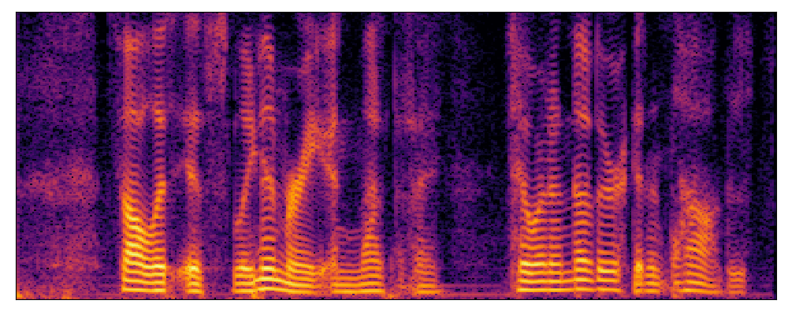

# 
 A Generative Correction Method for Noise-robust Speech Separation 

 Anonymous submission to Interspeech 2024 
 

<!-- ## Abstract

Speech separation, the process of isolating multiple speech sources from a mixed audio signal, remains a challenging task in noisy environments. 
In this paper, we introduce a generative correction method that refines the output of a discriminative model using a generative model for single-channel speech
separation. Furthermore, we fine-tune the generative model by optimizing a predictive loss to streamline the reverse process into a single step and correct errors resulting from solving the reverse process. Our method achieves state-of-the-art results on the LibriMix noisy dataset and demonstrates strong generalization to out-of-domain data.

## Model Overview
 -->

## Demo
### Samples 1 from LibriMix noisy test set.

| Mixture | Reference (speaker 1) | Estimated (SepFormer) | Estimated (GeCo) | Estimated (Fast-GeCo) |
| :--- | :--- | :--- | :--- | :--- |
|  |  |  |  |  |
| <audio src="demo/sepformer/item0_mix.wav" controls preload></audio> |<audio src="demo/sepformer/item0_source1.wav" controls preload></audio> |<audio src="demo/sepformer/item0_source1hatP.wav" controls preload></audio> |<audio src="demo/geco/item0_source1hatP.wav" controls preload></audio> |<audio src="demo/fastgeco/item0_source1hatP.wav" controls preload></audio> |
| | <strong>Reference (speaker 2)</strong> | <strong>Estimated (SepFormer)</strong> | <strong>Estimated (GeCo)</strong> | <strong>Estimated (Fast-GeCo)</strong> |
| |  |  |  |  |
| |<audio src="demo/sepformer/item0_source2.wav" controls preload></audio> |<audio src="demo/sepformer/item0_source2hatP.wav" controls preload></audio> |<audio src="demo/geco/item0_source2hatP.wav" controls preload></audio> |<audio src="demo/fastgeco/item0_source2hatP.wav" controls preload></audio> |

### Samples 2 from LibriMix noisy test set.

| Mixture | Reference (speaker 1) | Estimated (SepFormer) | Estimated (GeCo) | Estimated (Fast-GeCo) |
| :--- | :--- | :--- | :--- | :--- |
|  |  |  |  |  |
| <audio src="demo/sepformer/item1_mix.wav" controls preload></audio> |<audio src="demo/sepformer/item1_source1.wav" controls preload></audio> |<audio src="demo/sepformer/item1_source1hatP.wav" controls preload></audio> |<audio src="demo/geco/item1_source1hatP.wav" controls preload></audio> |<audio src="demo/fastgeco/item1_source1hatP.wav" controls preload></audio> |
| | <strong>Reference (speaker 2)</strong> | <strong>Estimated (SepFormer)</strong> | <strong>Estimated (GeCo)</strong> | <strong>Estimated (Fast-GeCo)</strong> |
| |  |  |  |  |
| |<audio src="demo/sepformer/item1_source2.wav" controls preload></audio> |<audio src="demo/sepformer/item1_source2hatP.wav" controls preload></audio> |<audio src="demo/geco/item1_source2hatP.wav" controls preload></audio> |<audio src="demo/fastgeco/item1_source2hatP.wav" controls preload></audio> |

### Samples 3 from LibriMix noisy test set.

| Mixture | Reference (speaker 1) | Estimated (SepFormer) | Estimated (GeCo) | Estimated (Fast-GeCo) |
| :--- | :--- | :--- | :--- | :--- |
|  |  |  |  |  |
| <audio src="demo/sepformer/item2_mix.wav" controls preload></audio> |<audio src="demo/sepformer/item2_source1.wav" controls preload></audio> |<audio src="demo/sepformer/item2_source1hatP.wav" controls preload></audio> |<audio src="demo/geco/item2_source1hatP.wav" controls preload></audio> |<audio src="demo/fastgeco/item2_source1hatP.wav" controls preload></audio> |
| | <strong>Reference (speaker 2)</strong> | <strong>Estimated (SepFormer)</strong> | <strong>Estimated (GeCo)</strong> | <strong>Estimated (Fast-GeCo)</strong> |
| |  |  |  |  |
| |<audio src="demo/sepformer/item2_source2.wav" controls preload></audio> |<audio src="demo/sepformer/item2_source2hatP.wav" controls preload></audio> |<audio src="demo/geco/item2_source2hatP.wav" controls preload></audio> |<audio src="demo/fastgeco/item2_source2hatP.wav" controls preload></audio> |

### Samples 4 from LibriMix noisy test set.

| Mixture | Reference (speaker 1) | Estimated (SepFormer) | Estimated (GeCo) | Estimated (Fast-GeCo) |
| :--- | :--- | :--- | :--- | :--- |
|  |  |  |  |  |
| <audio src="demo/sepformer/item3_mix.wav" controls preload></audio> |<audio src="demo/sepformer/item3_source1.wav" controls preload></audio> |<audio src="demo/sepformer/item3_source1hatP.wav" controls preload></audio> |<audio src="demo/geco/item3_source1hatP.wav" controls preload></audio> |<audio src="demo/fastgeco/item3_source1hatP.wav" controls preload></audio> |
| | <strong>Reference (speaker 2)</strong> | <strong>Estimated (SepFormer)</strong> | <strong>Estimated (GeCo)</strong> | <strong>Estimated (Fast-GeCo)</strong> |
| |  |  |  |  |
| |<audio src="demo/sepformer/item3_source2.wav" controls preload></audio> |<audio src="demo/sepformer/item3_source2hatP.wav" controls preload></audio> |<audio src="demo/geco/item3_source2hatP.wav" controls preload></audio> |<audio src="demo/fastgeco/item3_source2hatP.wav" controls preload></audio> |

### Samples 5 from LibriMix noisy test set.

| Mixture | Reference (speaker 1) | Estimated (SepFormer) | Estimated (GeCo) | Estimated (Fast-GeCo) |
| :--- | :--- | :--- | :--- | :--- |
|  |  |  |  |  |
| <audio src="demo/sepformer/item4_mix.wav" controls preload></audio> |<audio src="demo/sepformer/item4_source1.wav" controls preload></audio> |<audio src="demo/sepformer/item4_source1hatP.wav" controls preload></audio> |<audio src="demo/geco/item4_source1hatP.wav" controls preload></audio> |<audio src="demo/fastgeco/item4_source1hatP.wav" controls preload></audio> |
| | <strong>Reference (speaker 2)</strong> | <strong>Estimated (SepFormer)</strong> | <strong>Estimated (GeCo)</strong> | <strong>Estimated (Fast-GeCo)</strong> |
| |  |  |  |  |
| |<audio src="demo/sepformer/item4_source2.wav" controls preload></audio> |<audio src="demo/sepformer/item4_source2hatP.wav" controls preload></audio> |<audio src="demo/geco/item4_source2hatP.wav" controls preload></audio> |<audio src="demo/fastgeco/item4_source2hatP.wav" controls preload></audio> |

### Samples 6 from LibriMix noisy test set.

| Mixture | Reference (speaker 1) | Estimated (SepFormer) | Estimated (GeCo) | Estimated (Fast-GeCo) |
| :--- | :--- | :--- | :--- | :--- |
|  |  |  |  |  |
| <audio src="demo/sepformer/item5_mix.wav" controls preload></audio> |<audio src="demo/sepformer/item5_source1.wav" controls preload></audio> |<audio src="demo/sepformer/item5_source1hatP.wav" controls preload></audio> |<audio src="demo/geco/item5_source1hatP.wav" controls preload></audio> |<audio src="demo/fastgeco/item5_source1hatP.wav" controls preload></audio> |
| | <strong>Reference (speaker 2)</strong> | <strong>Estimated (SepFormer)</strong> | <strong>Estimated (GeCo)</strong> | <strong>Estimated (Fast-GeCo)</strong> |
| |  |  |  |  |
| |<audio src="demo/sepformer/item5_source2.wav" controls preload></audio> |<audio src="demo/sepformer/item5_source2hatP.wav" controls preload></audio> |<audio src="demo/geco/item5_source2hatP.wav" controls preload></audio> |<audio src="demo/fastgeco/item5_source2hatP.wav" controls preload></audio> |

### Samples 7 from LibriMix noisy test set.

| Mixture | Reference (speaker 1) | Estimated (SepFormer) | Estimated (GeCo) | Estimated (Fast-GeCo) |
| :--- | :--- | :--- | :--- | :--- |
|  |  |  |  |  |
| <audio src="demo/sepformer/item6_mix.wav" controls preload></audio> |<audio src="demo/sepformer/item6_source1.wav" controls preload></audio> |<audio src="demo/sepformer/item6_source1hatP.wav" controls preload></audio> |<audio src="demo/geco/item6_source1hatP.wav" controls preload></audio> |<audio src="demo/fastgeco/item6_source1hatP.wav" controls preload></audio> |
| | <strong>Reference (speaker 2)</strong> | <strong>Estimated (SepFormer)</strong> | <strong>Estimated (GeCo)</strong> | <strong>Estimated (Fast-GeCo)</strong> |
| |  |  |  |  |
| |<audio src="demo/sepformer/item6_source2.wav" controls preload></audio> |<audio src="demo/sepformer/item6_source2hatP.wav" controls preload></audio> |<audio src="demo/geco/item6_source2hatP.wav" controls preload></audio> |<audio src="demo/fastgeco/item6_source2hatP.wav" controls preload></audio> |

### Samples 8 from LibriMix noisy test set.

| Mixture | Reference (speaker 1) | Estimated (SepFormer) | Estimated (GeCo) | Estimated (Fast-GeCo) |
| :--- | :--- | :--- | :--- | :--- |
|  |  |  |  |  |
| <audio src="demo/sepformer/item7_mix.wav" controls preload></audio> |<audio src="demo/sepformer/item7_source1.wav" controls preload></audio> |<audio src="demo/sepformer/item7_source1hatP.wav" controls preload></audio> |<audio src="demo/geco/item7_source1hatP.wav" controls preload></audio> |<audio src="demo/fastgeco/item7_source1hatP.wav" controls preload></audio> |
| | <strong>Reference (speaker 2)</strong> | <strong>Estimated (SepFormer)</strong> | <strong>Estimated (GeCo)</strong> | <strong>Estimated (Fast-GeCo)</strong> |
| |  |  |  |  |
| |<audio src="demo/sepformer/item7_source2.wav" controls preload></audio> |<audio src="demo/sepformer/item7_source2hatP.wav" controls preload></audio> |<audio src="demo/geco/item7_source2hatP.wav" controls preload></audio> |<audio src="demo/fastgeco/item7_source2hatP.wav" controls preload></audio> |

### Samples 9 from LibriMix noisy test set.

| Mixture | Reference (speaker 1) | Estimated (SepFormer) | Estimated (GeCo) | Estimated (Fast-GeCo) |
| :--- | :--- | :--- | :--- | :--- |
|  |  |  |  |  |
| <audio src="demo/sepformer/item8_mix.wav" controls preload></audio> |<audio src="demo/sepformer/item8_source1.wav" controls preload></audio> |<audio src="demo/sepformer/item8_source1hatP.wav" controls preload></audio> |<audio src="demo/geco/item8_source1hatP.wav" controls preload></audio> |<audio src="demo/fastgeco/item8_source1hatP.wav" controls preload></audio> |
| | <strong>Reference (speaker 2)</strong> | <strong>Estimated (SepFormer)</strong> | <strong>Estimated (GeCo)</strong> | <strong>Estimated (Fast-GeCo)</strong> |
| |  |  |  |  |
| |<audio src="demo/sepformer/item8_source2.wav" controls preload></audio> |<audio src="demo/sepformer/item8_source2hatP.wav" controls preload></audio> |<audio src="demo/geco/item8_source2hatP.wav" controls preload></audio> |<audio src="demo/fastgeco/item8_source2hatP.wav" controls preload></audio> |

### Samples 10 from LibriMix noisy test set.

| Mixture | Reference (speaker 1) | Estimated (SepFormer) | Estimated (GeCo) | Estimated (Fast-GeCo) |
| :--- | :--- | :--- | :--- | :--- |
|  |  |  |  |  |
| <audio src="demo/sepformer/item9_mix.wav" controls preload></audio> |<audio src="demo/sepformer/item9_source1.wav" controls preload></audio> |<audio src="demo/sepformer/item9_source1hatP.wav" controls preload></audio> |<audio src="demo/geco/item9_source1hatP.wav" controls preload></audio> |<audio src="demo/fastgeco/item9_source1hatP.wav" controls preload></audio> |
| | <strong>Reference (speaker 2)</strong> | <strong>Estimated (SepFormer)</strong> | <strong>Estimated (GeCo)</strong> | <strong>Estimated (Fast-GeCo)</strong> |
| |  |  |  |  |
| |<audio src="demo/sepformer/item9_source2.wav" controls preload></audio> |<audio src="demo/sepformer/item9_source2hatP.wav" controls preload></audio> |<audio src="demo/geco/item9_source2hatP.wav" controls preload></audio> |<audio src="demo/fastgeco/item9_source2hatP.wav" controls preload></audio> |